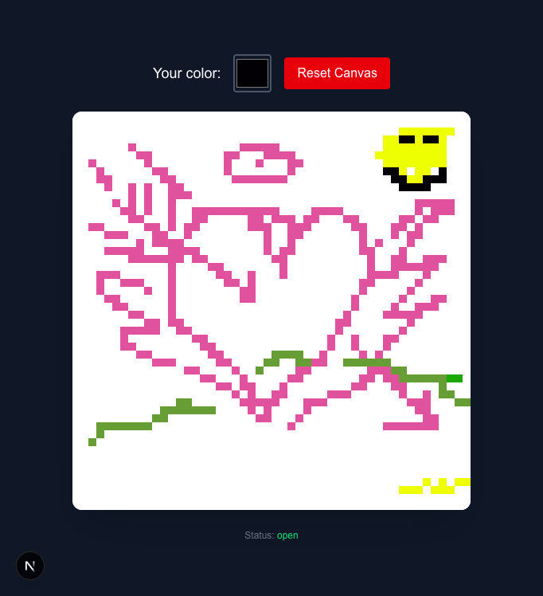

# Draw together

This is a small vibe-coded application that I created during a self-development day at work. My goal was to read about Redis Streams and then use some of the features while also creating something fun.

Steps to launch locally:

1. Launch redis and install dependencies
```sh
docker run --name redis -p 6379:6379 -d redis:7
bun install
```

2. Start WebSockets server
```sh
bun ws
```

In a separate terminal, start the main app:

```sh
bun dev
```

Get your computer's IP address:

```sh
ifconfig | grep "inet " | grep -v 127.0.0.1
```

Share `<YOUR_IP>:3000` with your peers. This app works on mobile devices and personal computers that are one the same Wi-Fi.




